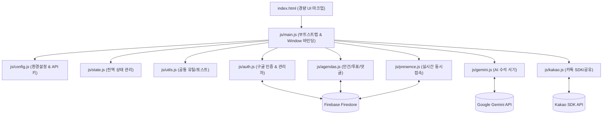

# 🏛️ 시스템 아키텍처 및 모듈 가이드 (ARCHITECTURE.md)

제26대 학생회 브리핑룸의 소프트웨어 구조, 프론트엔드 모듈 설계 및 클라우드 데이터 모델 명세서입니다.

---

## 1. 아키텍처 전환 개요 (Monolith → ES Module)

- **이전 구조 (v1.0 ~ v2.0)**:
  - 단일 `index.html` 파일(약 3,500줄, 177KB) 내에 HTML 구조, 스타일, 인라인 스크립트, 비즈니스 로직, Firebase 통신이 모두 집중되어 있었습니다.
  - 사소한 구문 에러나 문자열 오타 하나로 전체 페이지 파싱이 중단되어 **초기 화면 무한 로딩 스피너 및 구글 로그인 버튼 먹통** 현상이 발생했습니다.
- **개선 구조 (v2.1+)**:
  - `index.html`을 순수 UI 마크업(777줄, 51KB)으로 대폭 경량화.
  - 모든 기능 로직을 책임별 9개의 독립 ES 모듈(`js/*.js`)로 분리.
  - HTML 내 `onclick`, `onsubmit` 인라인 이벤트와 완벽히 호환되도록 `main.js`에서 전역 객체(`window`)에 안전하게 브릿지 바인딩.



---

## 2. 프론트엔드 모듈 상세 역할

### 1) `js/config.js`
- **역할**: Firebase App 설정, 컬렉션 App ID(`doksan-briefing-room`), 관리자 이메일 목록 및 API Key 관리.
- **주요 상수/변수**:
  - `MASTER_ADMIN_EMAIL`: 회장 마스터 계정 (`admin@example.com`)
  - `CO_ADMIN_EMAIL`: 부회장 관리자 계정 (`user@example.com`)
  - `ADMIN_EMAILS`: 공식 관리자 이메일 화이트리스트
  - `geminiApiKey`, `kakaoJsKey`: 클라우드 DB로부터 동적 갱신되는 런타임 키

### 2) `js/state.js`
- **역할**: 단일 진실 공급원(Single Source of Truth) 전역 반응형 상태 관리.
- **주요 상태 객체**:
  - `currentUser`: 현재 사용자의 세션 정보 (`uid`, `name`, `grade`, `role`, `status`, `isAdmin`, `canApprove` 등)
  - `agendas`: 전체 실시간 안건 배열
  - `onlineUsers`: 현재 브리핑룸에 동시 접속 중인 부원 목록
  - `expandedAgendaIds`: 상세 펼침 상태인 안건 ID Set

### 3) `js/utils.js`
- **역할**: XSS 방지 HTML 이스케이프, 텍스트 정제, UI 피드백 유틸리티.
- **주요 함수**:
  - `escapeHtml(str)`: 악성 스크립트 인젝션 차단
  - `cleanAiSummaryText(text)`: 마크다운 및 불필요 문자열 정제
  - `showToast(msg, type)`: 우측 하단 플로팅 토스트 알림 (success, warning, info)
  - `showCustomConfirm(msg, onConfirm)`: 학생회 테마 확인 모달
  - `switchView(viewName)`: 화면 전환 (`loading`, `logged-out`, `pending`, `main`)

### 4) `js/presence.js`
- **역할**: 부원들의 실시간 동시 접속 상태 감지 및 동기화.
- **주요 기능**:
  - 30초 주기 하트비트(`syncPresenceToCloud`) 전송
  - 90초 이상 무응답 시 자동 오프라인 처리
  - 화면 비활성화(`visibilitychange`) 및 탭 종료(`beforeunload`) 시 즉시 오프라인 플래그 반영
  - `toggleOnlineUsersModal()`: 실시간 접속 중인 부원 명단 팝업 렌더링

### 5) `js/gemini.js`
- **역할**: 제26대 학생회 수석 서기 AI 회의 결론 도출 엔진.
- **주요 기능**:
  - 투표 현황 + 부원 댓글 피드백을 실시간 종합 분석
  - **다중 모델 폴백 체인**: `gemini-3.6-flash` (최우선 순위, 고속/무중단) → `gemini-2.5-flash` → `gemini-3.7-flash` → `gemini-3.8-flash`
  - 클라우드 동적 API 키 설정: 관리자 콘솔에서 키 입력 시 즉시 Firestore `config/settings`에 저장 및 전체 부원 실시간 배포

### 6) `js/kakao.js`
- **역할**: 카카오 공식 SDK 연동 및 단톡방 안건 공유.
- **주요 기능**:
  - Kakao JavaScript SDK 동적 초기화
  - `openKakaoShareModal(agendaId)`: 안건 공유 팝업 오픈
  - `executeKakaoShare()`: 카카오 커스텀 피드 메시지 또는 텍스트 템플릿으로 카카오톡 앱 직접 연동 공유

### 7) `js/agendas.js`
- **역할**: 안건 생애주기, 실시간 의결 투표, 댓글/답글 시스템.
- **주요 기능**:
  - `renderAgendas()`: 필터별(전체/진행중/완료/투표형/의견수렴형) 고성능 카드 렌더링
  - `submitVote()`: 1인 1표 보장 실시간 투표 집계 및 AI 요약 자동 트리거
  - `submitComment()`: **댓글 생성 시 버튼 로딩 스피너 + 신규 댓글 하이라이트 애니메이션(commentPopIn) + 부드러운 스크롤 자동 이동**
  - 안건 생성/수정/삭제/마감 상태 전환

### 8) `js/auth.js`
- **역할**: Google OAuth 인증, 부원 가입 신청/승인 게이트키퍼, 관리자 콘솔.
- **주요 기능**:
  - `handleGoogleLogin()`: 구글 팝업 로그인
  - 미승인(`pending`) / 승인(`approved`) / 반려(`rejected`) 3단계 권한 제어
  - 관리자 콘솔: 부원 승인/반려, 임원 권한 부여, 학년/직책 수정, 회원 삭제

### 9) `js/main.js`
- **역할**: 모듈 통합 진입점 및 앱 부트스트래핑.
- **주요 기능**:
  - 브라우저 인라인 핸들러용 `window.*` 전역 노출
  - DOMContentLoaded 시점 초기 세션 복원 및 클라우드 실시간 리스너 가동

---

## 3. Firestore 클라우드 데이터베이스 스키마

기본 경로: `artifacts/doksan-briefing-room/public/data/`

### 3.1 `agendas` 컬렉션 (안건 데이터)
```json
{
  "id": "ag-1741567890123",
  "title": "2026학년도 1학기 봄맞이 버스킹 & 포토존 부스 운영의 건",
  "desc": "점심시간을 활용한 부원 주도 행사 기획안...",
  "type": "vote",              // "vote" | "discuss"
  "status": "active",          // "active" (진행중) | "closed" (의결완료)
  "createdAt": 1741567890123,
  "authorName": "유다은",
  "authorRole": "회장단",
  "options": [
    {
      "id": "opt-1",
      "text": "찬성 (버스킹 + 포토존 부스 추진)",
      "votes": ["유다은", "이하은", "김선배"]
    },
    {
      "id": "opt-2",
      "text": "수정안 (음향/안전 문제로 포토존만 진행)",
      "votes": ["박지원"]
    }
  ],
  "comments": [
    {
      "id": "c-1741567990123-ab12",
      "uid": "google-uid-xyz",
      "author": "김선배",
      "role": "2학년 행사기획부",
      "text": "작년에도 포토존 반응이 제일 좋았어서...",
      "time": "14:20"
    }
  ],
  "aiSummary": "📊 [부원 의견 종합 분석]...\n🎯 [수요일 회의 권고 결론]..."
}
```

### 3.2 `users` 컬렉션 (부원 및 권한 정보)
```json
{
  "uid": "google-uid-xyz",
  "email": "admin@example.com",
  "name": "유다은",
  "photoURL": "https://lh3.googleusercontent.com/...",
  "grade": "2학년",
  "classNum": "1반",
  "department": "회장단",
  "role": "회장",
  "status": "approved",        // "pending" | "approved" | "rejected"
  "isAdmin": true,             // 관리자 콘솔 접근 권한
  "canApprove": true,          // 부원 승인/반려 권한
  "updatedAt": 1741567890123
}
```

### 3.3 `presence` 컬렉션 (실시간 동시접속)
```json
{
  "uid": "google-uid-xyz",
  "name": "유다은",
  "grade": "2학년",
  "role": "회장",
  "department": "회장단",
  "photoURL": "https://lh3.googleusercontent.com/...",
  "lastSeen": 1741568999123,
  "online": true
}
```

### 3.4 `config/settings` 문서 (동적 시스템 설정)
```json
{
  "geminiApiKey": "AIzaSy...",
  "kakaoJsKey": "7f8b9...",
  "updatedAt": 1741569999123,
  "updatedBy": "admin@example.com"
}
```
